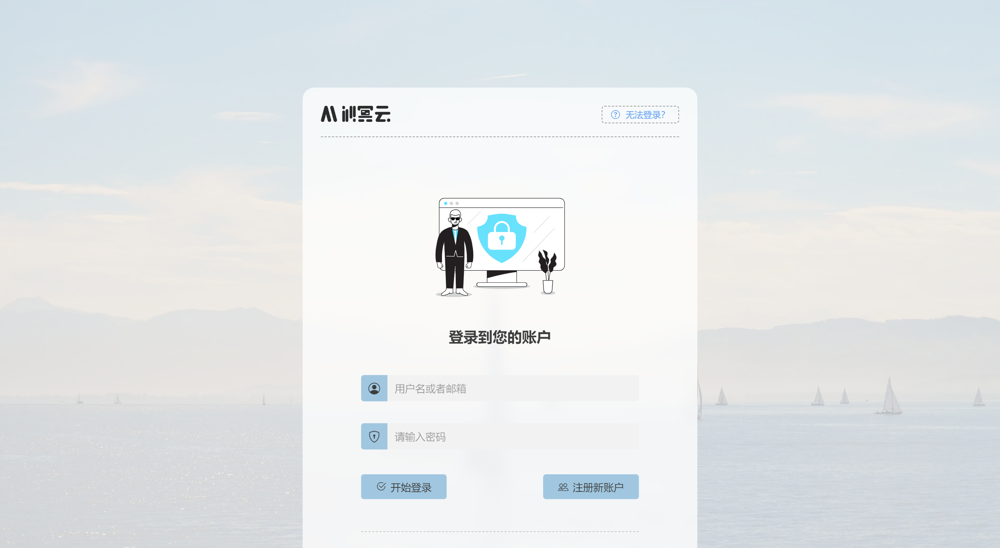
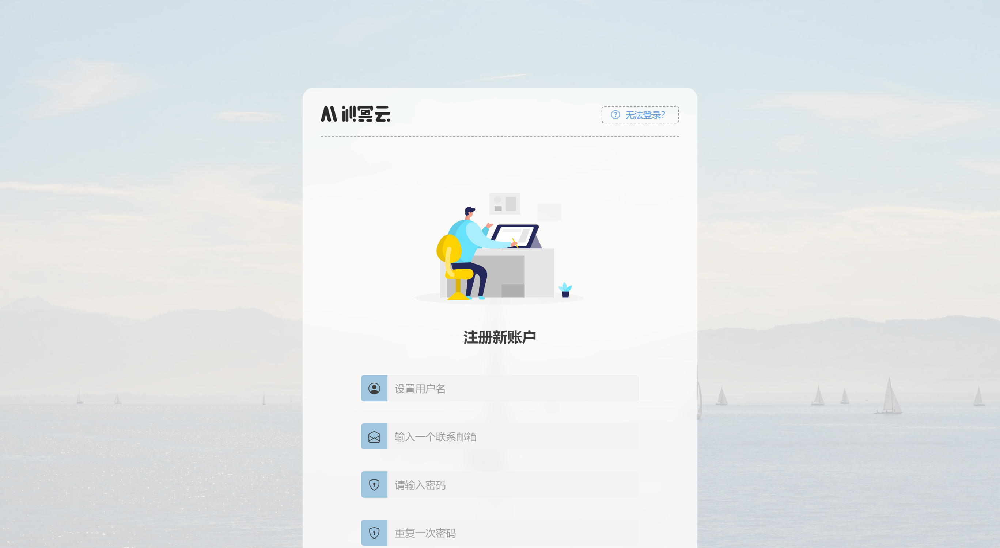

<h1 align="center">
    <a href="https://github.com/LinnBenson/BeLogin">
        BeLogin
    </a>
</h1>

    <strong>登录注册前端</strong>
     
    简洁、现代 的登录注册页面

    
    
    

## 安装

您可以使用 `git clone` 来拉取这个项目到您的 NPM 中，修改 API 后即可构建到您的程序当中。

## 展示图片

